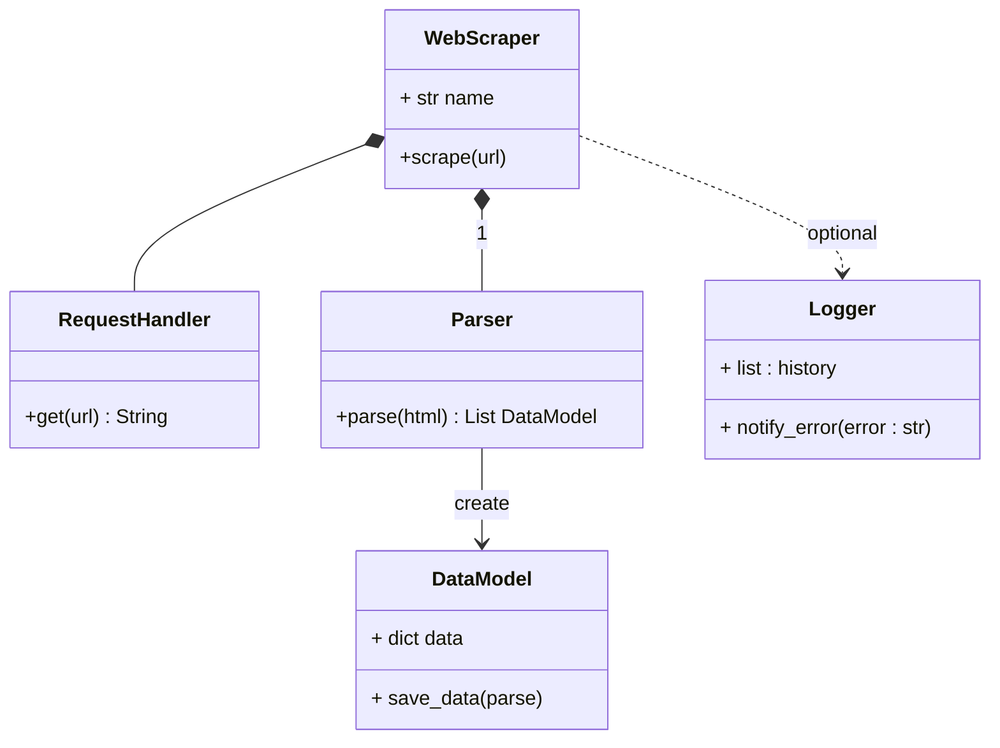

# Proyecto 2026-1: Web Scraping Startup

> Proyecto académico de Programación Orientada a Objetos enfocado en la extracción, organización y procesamiento de información web utilizando Python.

---

## Descripción

Actualmente existe una gran cantidad de información disponible en internet, pero gran parte de estos datos se encuentran desorganizados o distribuidos entre múltiples páginas web. Esto dificulta la búsqueda eficiente de información específica y su posterior análisis.

Como solución a este problema, surge el web scraping, una técnica utilizada para extraer información automáticamente desde sitios web y transformarla en datos organizados y procesables.

Este proyecto busca desarrollar una aplicación basada en Programación Orientada a Objetos (POO) capaz de realizar procesos básicos de web scraping estático, permitiendo obtener información desde diferentes páginas web, filtrarla y almacenarla en estructuras organizadas para su posterior análisis.

---

# Objetivos

## Objetivo General

Desarrollar un sistema orientado a objetos capaz de extraer y organizar información desde páginas web mediante técnicas de web scraping estático.

## Objetivos Específicos

- Implementar solicitudes HTTP para obtener información desde páginas web.
- Parsear y filtrar contenido HTML utilizando herramientas de scraping.
- Organizar los datos obtenidos en estructuras JSON.
- Aplicar principios de Programación Orientada a Objetos como encapsulamiento, composición y polimorfismo.
- Diseñar una arquitectura modular y escalable para futuros desarrollos.

---

# Tecnologías Utilizadas

- Python 3.13
- Visual Studio Code

## Librerías

- `requests` → realización de peticiones HTTP
- `bs4 (BeautifulSoup)` → análisis y extracción de contenido HTML
- `json` → almacenamiento estructurado de datos

---

# Funcionamiento General

El sistema seguirá tres etapas principales:

| Etapa | Descripción |
|---|---|
| Extracción | Obtención del contenido HTML de una página web |
| Procesamiento | Filtrado y organización de la información relevante |
| Almacenamiento | Conversión y guardado de los datos en formato JSON |

---

## Datos a Extraer

Actualmente se está evaluando qué tipo de información será procesada por el sistema.

Algunas posibilidades incluyen:

- Productos y precios
- Noticias
- Ofertas laborales
- Información académica

La fuente definitiva se definirá durante la fase de diseño.

# Programación Orientada a Objetos

El proyecto será desarrollado siguiendo los principios fundamentales de POO:

- Encapsulamiento
- Herencia
- Composición
- Polimorfismo

La arquitectura del sistema será diseñada mediante clases y relaciones entre objetos para facilitar el mantenimiento y escalabilidad del proyecto.

---

# Estado del Proyecto

Actualmente el proyecto se encuentra en fase de diseño y planificación.

Pendientes:
- Definición de clases y relaciones UML
- Definición de las fuentes de información específicas
- Diseño de la arquitectura interna
- Implementación del sistema de almacenamiento
- Posible desarrollo de interfaz de usuario

---

# Primer Borrador UML

# Referencias

- [Curso básico de Web Scraping](https://github.com/GEJ1/web_scraping_freecodecamp.git)
- [Web Scraping Nivel Medio](https://www.youtube.com/watch?v=mBoX_JCKZTE)
