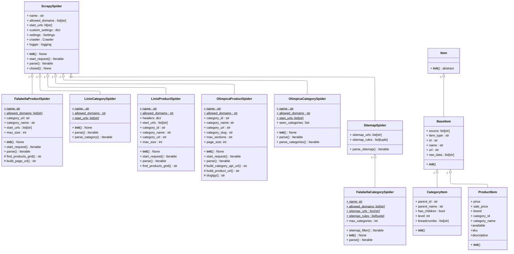

# Analisis Proyecto 2026-1
> A partir del recorrido y desarrollo funcional del proyecto, se hace una socialización del trabajo realizado y un primer borrador al README final del proyecto

**3M WEBSCRAPPER** herramienta orientada a objetdos para extraer,procesar y almacenar datos productos e-commerce ([olimpica](https://www.olimpica.com), [fallabela](https://www.falabella.com.co/) y [Linio](https://linio.falabella.com.co/)) diseñado para facilitar la comparación de precios y el análisis de tendencias

El presente busca dar una primera aproximación al proyecto a partir de sus funcionamientos principales, requerimientos, etc. No reemplaza la exposición a detalle realizado en la sustentación.

## Catalogo
- [requerimientos](#requerimientos)
- [Instalación](#instalacion)
- [Características](#caracteristicas)
- [Primera Demostración](#demo)
- [Arquitectura](#arquitectura)
- [Contribuir](#contribuir)

### Requerimientos 

- Python 3.13
- Sistema operativo: Linux/macOS (Windows soportado con WSL o ajustes)
- Dependencias principales: Scrapy

### Instalacion

1.Clonar el repositorio

```bash
git clone https://github.com/JuanCuartasCasas/Project-POO-2026.git
cd Projecto-POO-2026
```

2.Crear entorno virtual

```bash
python -m venv .venv
source .venv/bin/activate
pip install -r "requirements.txt"

```

3. Ejecutar `python main.py`

### caracteristicas
El programa se encarga de las funciones principales:

#### Diagrama UML

---


- Extracción de categorias y productos
- Serialización a JSON normalizado.
- Pipeline modular para validación
- Arquitectura Orientada a Objetos
  
### Demo


### Archivos generados


### arquitecura
```
PROJECT-POO-2026/
├─ 3m_webscrapper/
├─ main.py
│  ├─ Structure/
│  |  ├─ pipelines.py
│  |  ├─ middlewares.py
|  |  ├─ settings.py
|  |  ├─ excepts.py
│  |  ├─ Spiders/
|  |  |  ├─ FalabellaCategorySpider.py
|  |  |  ├─ FalabellaProductSpider.py
|  |  |  ├─ LinioCategorySpider.py
|  |  |  ├─ OlimpicaCategorySpider.py
|  |  |  ├─ OlimpicaProductSpider.py
├─ requirements.txt
└─ Scrapy.cfg
```
### Potencialidad de crecimiento

Con el fin de mantener una constancia en el desarollo, y afianzamiento en el paradigma OO, se pone a disposición temarios potencialmente aplicables a el proyecto:

- Agregación de GUI
- Conexión con bases de datos
- Estructura basada en Roles
- Autenticación Web

### Contribuir

Si se encuentra interesado en la contribución del desarollo del proyecto, realicé un PR con los cambios propuestos y haganoslo saber en nuestro [correo](mailto:jucuartasc@gmail.edu.co)

### Contactos

Developers: 
- Juan Diego Cuartas Casas -- [Github](https://github.com/JuanCuartasCasas)

